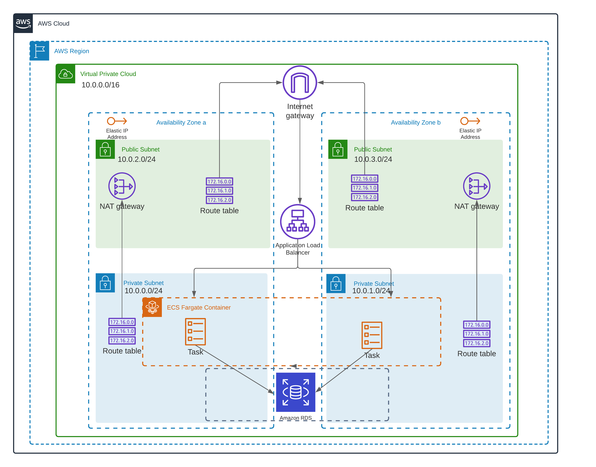

# AWS ECS Terraform

## Architecture
The following architecture describes the use of ECS (AWS Elastic Container Service) for the deployment of microservices or web applications through containers and exposing them through a single point of entry, in this case, a load balancer and, also considering a database.



This architecture includes:

* An architecture with high availability in which two Availability Zones are considered.
* A VPC configured with public and private subnets.
* An internet gateway to allow internet access
* In the public subnets, NAT Gateways are provisioned to allow outbound Internet access for resources in the private subnets.
* In the private subnets, an Amazon ECS cluster is provisioned and an Amazon RDS PostgreSQL database


## Deploying infrastructure

### Selecting a _workspace_
This project uses the feature provided by Terraform to select a workspace. I'm leveraging this feature in order to enable the code to be compatible with multiples environments. In other words, based on the workspaces this code can be deployed in, for instance, _development_ as **dev** or _production_ as **prod**. In this case I'm using `dev` and `prod`. 

Setting dev environment

```
export ENVIRONMENT=dev
```


Creating a new workspace
```
terraform workspace new $ENVIRONMENT
```

Selecting an existing workspace
```
terraform workspace select $ENVIRONMENT
```

### Initialize the project

_**Precondition:** Remember to stay logged in before to follow with the next steps._

To preserve state in each execution I chose to save them in S3. It's recommended enable versioning in S3 to allow recovering the states.
There are many options to set the backend configuration, you can find them here https://www.terraform.io/docs/backends/config.html#partial-configuration,
but here I let you one:

```
terraform init \
-backend-config="region=$REGION" \ 
-backend-config="bucket=$BUCKET_NAME" \ 
-backend-config="key=$STATE_FILE_NAME"

```
### Running tests
For testing the infrastructure I used terraform compliance, for more details visit the official documentation https://terraform-compliance.com. Test files are located in **_tests_** folder.

**Important:**
For running tests, I propose to create a new workspace dedicated to this. Specifically, I created a **tst** workspace that will allow generating a complete plan every time. Also, the variables of this workspace should exist in the `variables file`.

Creating workspace **tst**
```
terraform workspace new tst
```

Selecting workspace **tst**
```
terraform workspace select tst
```

Generate a plan to tests
```
terraform plan -out terraform.out
terraform show -json terraform.out > plan.json
```
Running tests 
```
terraform-compliance -p plan.json -f tests
```

### Generate plan
```
terraform plan
```

### Apply changes

```
terraform apply
```

## Bonus!!!
I created a script to execute the next:

* Format files into modules
* Terraform validate
* Terraform plan
* Run tests

```
./terraform-exec.sh
```